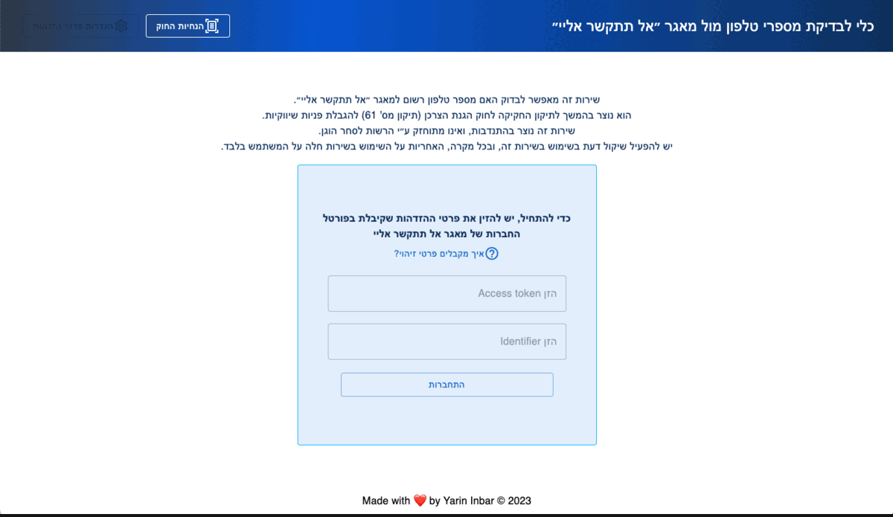

# "DO NOT CALL ME" check tool

In January 2023, The Israel's Consumer Protection approved new regulations which limit businesses from contacting consumers for marketing offers via phone calls.

This tool helps to check in convenient way whether a customers are registered to this database or not, and if it is possible to call them with a marketing offer.

All you have to do, is go to your personal zone in "Do not call me" official website, and generate an access token and identifer, and type it in this tool.

**This tool is used in few retail companies that perform telemarketing calls in Israel.** 

## Features

- Check the validation of the phone number.
- Check the validation of the JWT token from DNC.
- Save token & identifer using redux.
- Display instructions how to get the token from DNC website, and information about the law.

## Tech Stack

**Client:** React, Redux, Axios, Material Ui, Typescript, CSS

**Server:** Node, Express, Typescript

## Screenshots

## License

[MIT](https://choosealicense.com/licenses/mit/)

# do-not-call-me
